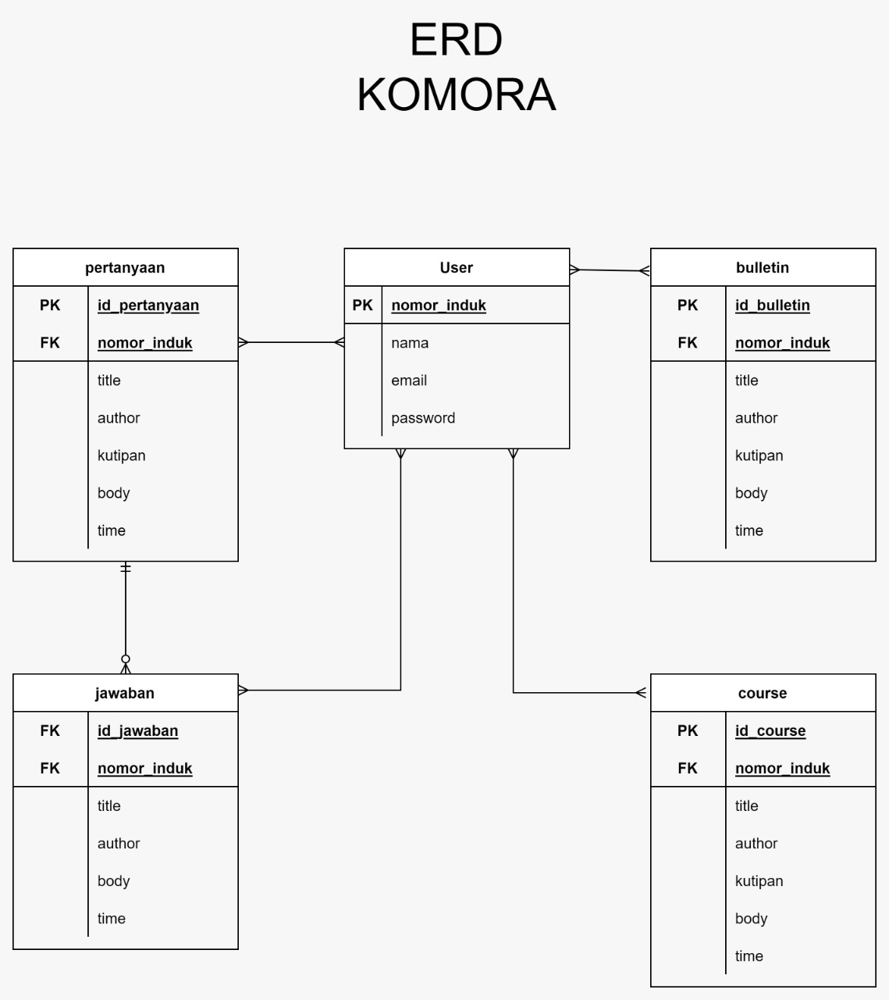

# KOMORA

## Tim Pengembang
| No | Nama | NIM | Peran |
|----|-----|------|-------|
| 1 | Ferdi B. M. Erari | G64180112 | Front End Developer |
| 2 | Muzaffar Wijaya | G64190033 | UI/X Researcher |
| 3 | Alfariz Gilang Septian | G64190066 | Project Manager & Back End Developer |
| 4 | Muhamad Rian Nayandra | G64190097 |  UI/X Designer |

## Latar Belakang
Forum sangat diperlukan untuk suatu komunitas, wadah yang berisi diskusi mengenai ketertarikan suatu komunitas terhadap hobi, pekerjaan, atau lain sebagainya. Di internet sudah cukup banyak web yang terbentuk untuk mewadahi keperluan diskusi komunitas tersebut. Bahkan Indonesia sendiri memiliki web forum besar yang sudah berdiri cukup lama dan sudah banyak digunakan oleh komunitas-komunitas yang ada di Indonesia.  
  
Ilmu Komputer sangat erat hubungannya dengan forum diskusi pada internet, banyak mahasiswa maupun dosen yang banyak terbantu oleh forum diskusi pada internet, contohnya Stack Overflow. Namun banyak mahasiswa dari Ilmu Komputer IPB University kesulitan untuk mendapatkan jawaban pada web forum tersebut, dikarenakan bahasan yang terlalu luas dan juga keterbatasan bahasa.  
  
Maka dari itu Komora siap membantu menjawab permasalahan dari mahasiswa tersebut. Komora adalah sebuah web forum tanya jawab seputar Ilmu Komputer IPB University yang bertujuan untuk membantu mahasiswa Ilmu Komputer. Selain itu Komora juga menyediakan course gratis terkait Ilmu Komputer bagi para mahasiswa untuk membantu mahasiswa dalam belajar.

## Tujuan
Membuat web yang dapat menampung pertanyaan, jawaban, dan course yang diberikan oleh mahasiswa, alumni dan dosen Ilmu Komputer IPB University.

## User Stories
- Sebagai seorang mahasiswa/dosen/alumni ilmu komputer IPB saya ingin bisa bertanya seputar ilmu komputer untuk membantu saya saat menemukan kesulitan dalam proses belajar.
- Sebagai seorang mahasiswa/dosen/alumni ilmu komputer IPB saya ingin bisa mendapatkan akses course gratis seputar ilmu komputer yang dibuat oleh dosen, alumni, dan mahasiswa ilmu komputer IPB lainnya untuk mempermudah proses belajar.
- Sebagai seorang mahasiswa/dosen/alumni ilmu komputer IPB saya ingin memiliki sebuah media untuk bisa memberikan materi pembelajaran kepada mahasiswa lainnya.
- Sebagai seorang mahasiswa/dosen/alumni ilmu komputer IPB saya ingin bisa mengakses sebuah halaman buletin mengenai komunitas yang ada di departemen Ilmu Komputer IPB agar saya selalu mengetahui informasi terbaru mengenai komunitas tersebut.

## Cakupan
Pengembangan sistem akan berbentuk sebuah website dengan fitur utama:
* Forum tanya jawab seputar Ilmu Komputer IPB
* Papan Buletin untuk komunitas yang ada di Ilmu Komputer IPB
* Course gratis yang dibuat oleh sesama pengguna Komora

## Kebutuhan Sistem
### User
- Mahasiswa Ilmu Komputer IPB
- Alumni Ilmu Komputer IPB
- Dosen Ilmu Komputer IPB

### Fitur Utama
* Forum tanya jawab seputar Ilmu Komputer IPB
* Papan Buletin untuk komunitas yang ada di Ilmu Komputer IPB
* Course gratis yang dibuat oleh sesama pengguna Komora

### Lingkungan Pengembangan
- Frontend : PHP & Blade
- Backend : MySQL
- Framework : Laravel
- Code Editor : VS Code

## Risiko
| No | Risiko | Probabilitas | *Impact* | Prioritas | Aksi Untuk Mengatasi |
|----|-----|------|-------|--------|---------|
| 1 | Perubahan Ide | 4 | 4 | Medium | Mengubah timeline pengerjaan dan mempersiapkan waktu cadangan |
| 2 | Source Code Terhapus | 1 | 10 | Medium | Backup source code |
| 3 |  Peretasan | 1 | 5 | Low | Menjaga kredibilitas akun |
| 4 | Perencanaan yang berselbihan | 10 | 8 | High | Evaluasi progress pengembangan |

## Metodologi
Metode yang digunakan pada pengembangan sistem Komora adalah metode prototyping, karena metode prototyping adaptif untuk para developer yang masih belum mahir pada bidangnya, sehingga pengembangan dapat selalu dilakukan walaupun memiliki banyak perubahan yang terjadi	

## Diagram UML
### Use Case Diagram
.png)
### Activity Diagram

 

### ERD

## Kendala Selama Pengembangan
- Sulitnya melakukan pertemuan lengkap secara langsung karena waktu, tempat, kesehatan, dan cuaca
- Saat melakukan meet secara online kurang efektif dikarenakan sinyal dari masing-masing anggota yang berbeda
- Pengembangan fitur bulletin dan course tertunda, dikarenakan tim pengembang mengalami error yang belum bisa diselesaikan

## Related Links
- Figma : https://www.figma.com/file/TkYtFNUkyV3pNS0XU5QT1z/MPPL-Kelompok-3-team-library?node-id=604%3A4050&t=yIbIfZkc20wmy6w3-1
- Demo Videos : https://drive.google.com/drive/folders/1Ji67p5hkHDMCMtm-J6W9mYuFTHCYMNFB?usp=sharing
- Test Case Sheets : https://docs.google.com/spreadsheets/d/1zZZrmGDNI6dJ61wXHmkGWdhuU7Ee8298Hbynt9Icl5w/edit?usp=sharing
- Trello : https://trello.com/b/NOgOholy/mppl-3
- KOMORA : https://projek-komora.000webhostapp.com/
